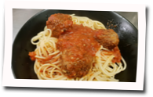

# Honor the gods

*The [OverTheWire Advent Bonanza 2018](https://advent2018.overthewire.org) challenge for Thursday 13 December 2018*

**Today we honor the Flying Spaghetti Monster by cooking a meal in its image. 
To receive the flag for this challenge, prepare the following dish (or a 
variant that fits your dietary requirements) and publically post a picture 
with accompanying nametag to twitter, with [@OverTheWireCTF](https://twitter.com/OverTheWireCTF) in CC.**

**Bonus 150 points for making the entire dish, including the spaghetti, from scratch. 
In that case, post a youtube video as proof, showing how you did it, including the 
handwritten note.**

**UPDATE (2018-12-19): For those people without twitter, we do accept submissions through IRC.
In this case, we will post your picture/video on the @OverTheWireCTF twitter account and send
you the flag through IRC.**

### Ingredients

to serve 2.38 people:

* 500 grams of minced meat
* 1 egg (remove and throw out the shell)
* 25 grams of breadcrumb
* pepper, salt, nutmeg
* oil or butter
* 390g of tomato sauce
* about 1 liter of water (or enough to cover the spaghetti)
* 100gr of dry spaghetti

### Step 1: Make the meatballs

Put the minced meat, egg and breadcrumb in a bowl, add salt, pepper and nutmeg 
to taste and mix well.  Then form balls of roughly equal size. An ice-cream 
scoop is surprisingly useful to measure roughly identical volumes. 

Next, heat up some oil or butter in a pan and fry the meatballs on all sides 
over medium heat.

### Step 2: Add tomato sauce

Slowly heat up the ready-made tomato-sauce in a pan, together with the finished 
meatballs from Step 1.

### Step 3: Cook spaghetti

Boil water with salt and add the spaghetti so that the spaghetti is fully under 
the waterline.  Stir the spaghetti so it doesn't clump together.  Let boil for 
the required amount of time (See the package the spaghetti came in, probably 
around 10 minutes)

### Step 4: Show off your work and enjoy

Serve the spaghetti together with tomato sauce and meatballs on a plate.

Don't forget to add a **handwritten** note with:

* Your team name
* The words "OverTheWire Advent Bonanza 2018"
* Holiday greetings

Take a picture when ready and post it publicly on twitter, with [@OverTheWireCTF](https://twitter.com/OverTheWireCTF) in CC.

Enjoy and Happy Holidays!!

